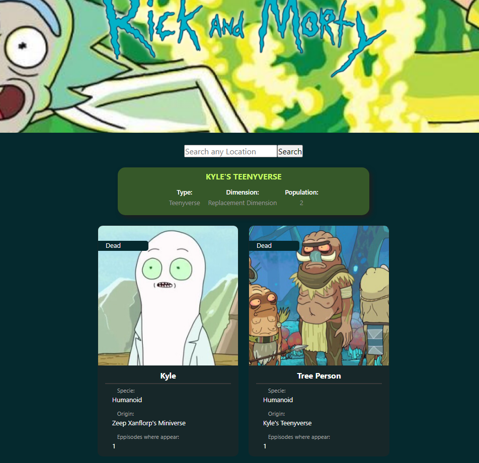

## ⛅ Rick and Morty APP

El proyecto es un aplicativo web que permite buscar información de los personajes de la serie Rick and Morty, consumiendo una API.

✌ 
 


## Autor

- [@HWatanab3](https://github.com/Hwatanab3)

## 🚀 Sobre Mi
Soy Desarrollador Front-end y Arquitecto, después modelar y renderizar por un tiempo, me pasé al mundo de la PROGRAMACIÓN. ¡Disfruto creando experiencias para todos!.

Entre mis éxitos destaco que durante mi formación, apoye a mis compañeros a mejorar en diferentes lenguajes de programación. Me enfoco en el FrontEnd, aunque no dejo abandonado el BackEnd que es de vital importancia para la experiencia del usuario.

Cuento con experiencia desarrollando aplicaciones web, y mi sueño es crear una ecosistema para fusionar mis pasiones: la programación y la arquitectura. Ayudaría a la sociedad brindar acceso al diseño Arquitectónico y Urbanístico.


## Stack

**Client:** Html, CSS, Javascript, React

## Contribuciones

¡Las contribuciones son siempre bienvenidas!

## 🔗 Links
[](https://portafolio-hwatanabe.netlify.app//)
[](https://www.linkedin.com/in/hirowatanabe)

## 🛠 Skills
- Javascript
- HTML
- CSS
- REACT.js

## Correrlo Localmente

Clona el proyecto.

```bash
  git clone https://github.com/Hwatanab3/rickandmorty
```

Ve al directorio del proyecto

```bash
  cd "nombre_proyecto"
```

Abrelo de forma local

```bash
  Usa npm run dev
```

Modificalo en tu editor favorito

```bash
  Te recomiendo VScode
```

Disfrutalo

```bash
  Puedes usarlo como plantilla
```

## Agradecimientos

A todas las personas que me apoyan, mis compañeros con los que comparto muchas noches y madrugadas de estudio.


## Feedback

Si encuentras algun error, bug, cucaracha u otro error me puedes escribir a hiroshiwatanabesaldivar@gmail.com.